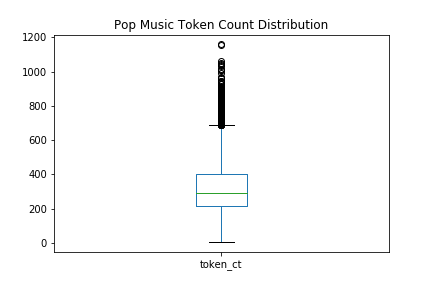
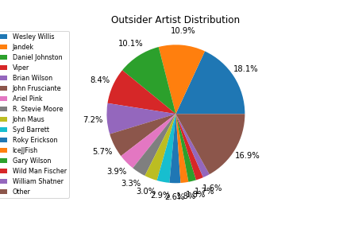
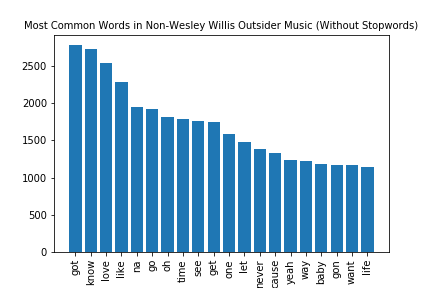

# A Linguistic Look Inside Outsider Music
## Final Report
Emma McKibbin | ECM68@pitt.edu    
May 1, 2022

#### Table of Contents:
1. [Project Overview](https://github.com/Data-Science-for-Linguists-2022/Outsider-Music-Linguistic-Analysis/blob/main/final_report.md#1-project-overview)
2. [What is Outsider Music?](https://github.com/Data-Science-for-Linguists-2022/Outsider-Music-Linguistic-Analysis/blob/main/final_report.md#2-what-is-outsider-music)
3. [Data collection](https://github.com/Data-Science-for-Linguists-2022/Outsider-Music-Linguistic-Analysis/blob/main/final_report.md#3-data-collection)
4. [Data Cleaning](https://github.com/Data-Science-for-Linguists-2022/Outsider-Music-Linguistic-Analysis/blob/main/final_report.md#4-data-cleaning)
    - 4.1 [Language Detection](https://github.com/Data-Science-for-Linguists-2022/Outsider-Music-Linguistic-Analysis/blob/main/final_report.md#41-language-detection)
5. [Analysis](https://github.com/Data-Science-for-Linguists-2022/Outsider-Music-Linguistic-Analysis/blob/main/final_report.md#5-analysis)    
    - 5.1 [Outsider Music vs. Pop Music](https://github.com/Data-Science-for-Linguists-2022/Outsider-Music-Linguistic-Analysis/blob/main/final_report.md#51-outsider-music-vs-pop-music)    
    - 5.2 [The Distribution Dilemma](https://github.com/Data-Science-for-Linguists-2022/Outsider-Music-Linguistic-Analysis/blob/main/final_report.md#52-the-distribution-dilemma)    
    - 5.3 [Outsider Music Internal Analysis](https://github.com/Data-Science-for-Linguists-2022/Outsider-Music-Linguistic-Analysis/blob/main/final_report.md#53-outsider-music-internal-analysis)
6. [The Initial Plan and the Inevitable Changes](https://github.com/Data-Science-for-Linguists-2022/Outsider-Music-Linguistic-Analysis/blob/main/final_report.md#6-the-initial-plan-and-the-inevitable-changes)
7. [Conclusion](https://github.com/Data-Science-for-Linguists-2022/Outsider-Music-Linguistic-Analysis/blob/main/final_report.md#7-conclusion)
8. References

### 1. Project Overview
This project analyzes a few very basic linguistic characteristics of the outsider music genre, first comparing across genres with a popular music dataset, then looking within the outsider genre to find possible incongruities between its top artists.  Though the initial research question was intending to study more broadly the "linguistic composition" of outsider music, the final analysis was limited to token count distribution and most frequent words, both with and without stopwords.  As described in the report that follows, the final form of this project wandered a bit from the initial comparative focus and became more of an investigation into the effects of skew in data collection.  Though the analysis here may not provide conclusive answers to the original research questions, it should provide insight and inform and future endeavors on the topic of Outsider Music linguistics.

### 2. What is Outsider Music?
The main focus of this analysis is the genre of outsider music.  This term is based upon the concept of "Outsider Art," which describes the work of unconventional artists who have no connections to masters of the craft and, because of this distancing, are frequently self-taught ([Britannica](https://www.britannica.com/art/outsider-art)).  Many outsider musicians suffer from mental illnesses, which serves to only further separate them from the traditional, or popular, music world.  Along with being self-taught, outsider musicians are also frequently self-recorded and self-produced, making it easy to hear similarities between outsider music and lo-fi music ([Wikipedia](https://en.wikipedia.org/wiki/Outsider_music)).

Outsider music has a reputation of being childlike, repetitive, nonsensical, or simplistic, but note that the genre description above does not necessarily lend itself to a very restrictive group of musicians or songs.  It seems the assumption of the genre's characteristics is not based upon musical aspects, since there's is little to generalize about the genre's overall instrumental sound, beats per minute (BPM), tone, setting, or vocal style.  Therefore, I wondered whether the assumption had its basis in the linguistic elements of outsider music, hence the ensuing analysis.

### 3. Data Collection
To be able to do the planned analysis, I first needed a corpus of outsider music lyrics.  I was unable to find an existing corpus, so I collected my own data instead.  Because outsider music is not a popular topic of study, there were only a few comprehensive musician lists available.  I used [Wikipedia's Outsider Musician list](https://en.wikipedia.org/wiki/Category:Outsider_musicians), and because I had initially assumed I would be working with scraped HTML pages to retrieve the lyric data, I used [beautifulsoup](https://beautiful-soup-4.readthedocs.io/en/latest/#) in a [python script](https://github.com/Data-Science-for-Linguists-2022/Outsider-Music-Linguistic-Analysis/blob/main/scripts_%26_analysis/0_wiki_musicians.py) to scrape the list from the Wikipedia page as practice, rather than simply copying and pasting the list into a text file.  Despite this adherence to computational methods, in the end I resorted to manually editing out extraneous text from the list, like quotations marks or Wikipedia tags (e.g., "(musician)", "(rapper)").

Once the [musician list](https://github.com/Data-Science-for-Linguists-2022/Outsider-Music-Linguistic-Analysis/blob/main/scripts_%26_analysis/0_wiki_musicians.txt) was collected, I used the [Genius API](https://docs.genius.com/) and John W. Miller's [lyricsgenius](https://lyricsgenius.readthedocs.io/en/master/) package to request each artist's data in JSON format from [Genius.com](https://genius.com/).  This process wasn't perfect since 25 artists were not found on Genius, and 14 artist requests returned files for the wrong artist, as can be seen in the corresponding [notebook](https://github.com/Data-Science-for-Linguists-2022/Outsider-Music-Linguistic-Analysis/blob/main/scripts_%26_analysis/1_lyricsgenius_requests.ipynb).  This issue could have resulted in a massive reduction to potential sample size, but after loading the song titles, artists, and lyrics into a [data frame](https://github.com/Data-Science-for-Linguists-2022/Outsider-Music-Linguistic-Analysis/blob/main/scripts_%26_analysis/2_load_json_to_df.ipynb), the uncleaned data still had 3,388 items.

### 4. Data Cleaning
The data frame as-is after data collection contained many artifacts from the Genius site, as well as formatting issues and empty entries.  This led to some rather extensive [cleaning](https://nbviewer.org/github/Data-Science-for-Linguists-2022/Outsider-Music-Linguistic-Analysis/blob/main/scripts_%26_analysis/3_data_cleaning_and_exploration.ipynb#Data-Cleaning), which amounted to a great portion of the work put in to this project.  I removed instances of "*Song Title* Lyrics" from the beginning of every lyric entry, then stripped newline characters from the ends of the data, removed "Embed" from the end of all lyric data, replaced text-internal newlines with spaces, and removed songs with lyric entries that began with "Transcription in progress by..."

These adjustments were anticipated just based on a short initial exploration of the data counts and organization.  However, there were additional formatting issues, which were caught during language detection, and other lyric issues, similar to the "Transcription in progress by..." entries.  The latter issues remain in the data, as those that were encountered did not appear to follow any pattern that would be easy to sort out of the data computationally, and manually removing these items seemed as if it might not be worth the slight return in accuracy of the analysis.

#### 4.1 Language Detection
While exploring the data, I had encountered a few instances of non-English lyrics, most notably Japanese, which might confound the following analysis by introducing linguistic features that English does not have.  Japanese, for example, uses a somewhat syllable-based alphabet, which could cause issues with tokenization, leading to inaccurate token distributions.  In order to eliminate non-English data, I tried two approaches, character-encoding based language detection and spaCy's LanguageDetector package, both of which were rather unsuccessful but still contributed, in some way, to the final cleaned dataset.

##### Character-Encoding Based Language detection
The first approach to language detection checked whether each lyric text used Unicode characters that could not be encoded in ASCII.  The intention was to identify texts that used characters not in the English alphabet, assuming that only non-English texts would do so.  However, it happened to be the case that many formatting characters and specially formatted punctuation, as well as any accented letters, would cause the lyrics to be flagged as non-English.  This rudimentary method tagged far too many English lyrics as non-English and, if trusted, would have massively reduced the outsider music dataset.

Even though I couldn't use the binary decision made by this method to detect non-English data, it was useful to clean formatting issues that I was not able to anticipate just from the initial data exploration alone.  Special whitespace characters like "\u2005" and "\u205f" occurred in only a few entries and likely would have gone unnoticed if not for this failed attempt at language detection.

I also attempted to implement this method more continuously, by creating a column in the data for the percentage, instead of a boolean value indicating presence, of non-ASCII characters.  However, it was difficult to find a cutoff percentage that would split the English and non-English data effectively.  Because some English lyrics entries were very short, even one specially formatted character would result in very high non-English character percentages, while very long non-English entries would have much lower non-English character percentages.  The character-encoding method of language detection, then, was not effective for removing any non-English but was useful for identifying additional text cleaning issues.

##### SpaCy's LanguageDetector
Having not yet given up on language detection, I decided to use a more "intelligent" language detector, which would be able to recognize English lexemes, as opposed to just characters alone.  I used spaCy's [LanguageDetector](https://spacy.io/universe/project/spacy-langdetect) and the small English language model to detect the languages of all of the lyric entries.  

This method appeared to guarantee a fully English dataset, if the current dataset were to be limited to only the songs that had lyrics identified as "en," or English, by the language detector.  However, this would have eliminated many English lyrics that were identified as other languages.  A cover of "Deck the Halls," for example, was labelled as Spanish, likely due to the multitude of "la"s present in the text.  By visually scanning all of the lyrics tagged as non-English, I determined that only the Japanese and Swedish lyrics could be definitively eliminated without removing any English language data.  All other languages had instances of misclassified English lyrics and could not be removed in their entireties.  Given more time, I would have liked to manually remove the remaining non-English lyrics I found while scanning, but in order to start the analysis, I needed to set aside the issue of language detection.

The language detection output was used to remove Japanese data, Swedish data, and "UNKNOWN" data, which were the empty string lyrics that had yet to be removed.

### 5. Analysis

#### 5.1 [Outsider Music](https://nbviewer.org/github/Data-Science-for-Linguists-2022/Outsider-Music-Linguistic-Analysis/blob/main/scripts_%26_analysis/3_data_cleaning_and_exploration.ipynb#Analysis-of-Outsider-Music) vs. [Pop Music](https://nbviewer.org/github/Data-Science-for-Linguists-2022/Outsider-Music-Linguistic-Analysis/blob/main/scripts_%26_analysis/3_data_cleaning_and_exploration.ipynb#Analysis-of-Popular-Music)
I started by comparing the outsider music token distribution and twenty most common words to the same statistics in a popular music dataset.  The dataset I chose to work with is Kaylin Pavlik's ["50 Years of Pop Music"](https://github.com/walkerkq/musiclyrics) dataset, where she has compiled the lyrics of the Billboard Hot 100 over 51 years.

##### Token Distribution

First, note that there are scale differences on these two visualizations.  With that in mind, it appears that the means are not too different, with outsider music being a bit shorter on average (mean = 215 tokens) and pop music being a bit longer (mean = 330 tokens).  However, outsider music covers a music larger range of song lengths, with the longest song at 2,115 tokens and the shortest at 1, while popular music has a longest song of 1,158 tokens and a shortest song with 5 tokens.  Popular music is ever-so-slightly more distributed around its mean, with less distant outliers, so its distribution is more evenly spread that the outsider music data.

##### Most Common Words

Without stopwords, the two lists of most common words look fairly similar.  Note that I was unable to remove the words "cant" and "im" from the popular music list even after adjusting removing apostrophes from the stopwords list.  This is likely because the NLTK's stopwords expect that the text has been properly tokenized with the NLTK tokenizer, which splits words at apostrophes, whereas Pavlik's data already had all apostrophes removed.

What is important for the ensuing discussion are the 5th and 16th most common words in the outsider music data: "rock" and "ass."  Note that neither of these appear on the list of most common words for popular music, and despite being rather unusual, they occur more often in the lyrics than very common and expected words like "go," "oh," or "yeah."

#### 5.2 The Distribution Dilemma

In the outsider music dataset, the 15 top artists comprise 83.1% of the total data, leaving only 16.9% for the remaining 47 artists.  Wesley Willis, the most frequent artist, represents more of the data than the bottom 47 artists, with 18.1%.

In the popular music dataset, however, there are clearly many more artists represented.  Above, the top 15 artists are highlighted, leaving the remaining 2,320 artists collectively represented in the brown slice, making up 94% of the data.

To show this in proportion to the outsider music data, where 15 artists were 24% of the total artist population, the top 24% of artists have been separated into individual colored slices.  Though this graph is horrendous to look at, it does well to illustrate that Pavlik's pop dataset is not dominated by any one artist.  Madonna, the top artist here, only contributes 33 songs to the data, which is less than 1%.

Seeing how well-distributed the popular music dataset is makes it much clearer how skewed the outsider data truly is.

The graph above shows that the top 3 artists in the outsider music data, Wesley Willis, Jandek, and Daniel Johnston, represent nearly 40% of the data, while the remaining 59 artists only represent 60%.  This skew may not be so alarming if these top three artists produced exceptionally diverse discographies, but each artist has their own idiosyncrasies and style that they adhere to.  Wesley Willis, especially, formats his lyrics in a very similar manner across all 561 of his songs in this dataset, meaning this format and repetition overwhelms the diversity of the other artists' data.

#### 5.3 Outsider Music Internal Analysis
Because the skewed distribution was so apparent, I wanted to take a deeper look into how this skew might have affected the initial outsider versus popular music comparison.  In the [Jupyter notebook](https://nbviewer.org/github/Data-Science-for-Linguists-2022/Outsider-Music-Linguistic-Analysis/blob/main/scripts_%26_analysis/3_data_cleaning_and_exploration.ipynb#Breakdown-by-Most-Represented-Outsider-Musicians), I coded visualizations for both token distribution *and* the most common words, but for the sake of brevity, we'll only look at the most common words here.

First, I compared Wesley Willis against the other outsider music data.

Unsurprisingly, Willis's two most common words are "rock" and "ass," while the other outsider music doesn't represent either of those tokens in its top 20, which is overall fairly tame.  To demonstrate this disparity further, "rock" comprised 0.048% of the non-Wesley Willis data and 2.6% of Willis's lyric data, making "rock" 50 times more common in Willis's music than in the music of other outsider artists.  "Ass" followed a similar pattern, making up 0.02% of the non-Wesley Willis data and 0.14% of the Wesley Willis data.

Next, I wanted to look into the possible effects of the next two most frequent artists: Jandek and Daniel Johnston.  The purpose of this investigation is to determine whether or not it was Willis's especially idiosyncratic music that skewed the data, or if the other more frequent outsider artists also played a role.

Even without these two artists (as well as Wesley Willis) present in the outsider dataset, the most common words are fairly similar.  Jandek's top 10 words occur in the top 20 words of the outsider dataset, even without his music present.  The same is true for Daniel Johnston, with the exception of "really," but "really" did not appear in the twenty most common words for the total dataset during the comparative analysis.

This suggests that Jandek and Daniel Johnston, though heavily represented in terms of artist distribution, may not be skewing the data away from the overall trend of the rest of the dataset, whereas Wesley Willis's unique word choice and style is overrepresented and is causing inaccuracies in the overall analysis.

### 6. The Initial Plan and the Inevitable Changes
As can be seen in my original [project plan](https://github.com/Data-Science-for-Linguists-2022/Outsider-Music-Linguistic-Analysis/blob/main/project_plan.md), one of the primary goals of this study was to analyze outsider music data against the popular music genre and determine what sets the two apart linguistically.  However, after seeing the disparity in artist distribution between the two datasets and noticing the strange words that appeared in the most common tokens, it no longer seemed meaningful to compare the two datasets.  It was clear that something was wrong with the data I had collected and that the skew I had noticed and accepted early on had become unacceptable, at least for the purposes of my intended analysis.

A great deal of my effort in this project went to data collection and cleaning, so by the time I had reached analysis portion, there was very little time left in the semester to work on solving the skewed distribution and continuing the project according to my original plan.  This meant that, instead of analyzing the lyrical themes or creating a binary classifier to identify the most informative features of each genre, I decided to conduct more of a meta-analysis of the effects of the artist skew.

Additionally, I had looked forward to extensive visualization work but found it difficult to get to a point in the analysis where I had results to visualize.  As can be seen in my [visualizations](https://github.com/Data-Science-for-Linguists-2022/Outsider-Music-Linguistic-Analysis/tree/main/images), the graphs that I used are more or less slightly altered versions of the same three plot types, with only a few adjustments to the plotting parameters, and I struggled with adjusting pie plot labels, as can be seen in the artist distribution graphs, where the percentages begin to overlap as the slices get smaller.  Because so much of my project was focused on the data itself, the visualization aspect fell a bit to the wayside as I tried to investigate the distribution issue.

### 7. Conclusion
Although this project did not quite accomplish what it set out to do at its conception, I feel that I have learned very valuable skills and lessons from working with this data.  I now know much more about the intricacies of data collection, especially the importance of distribution, and have seen how different data cleaning schemas from multiple datasets can interact, whether the effect of that interaction on accuracy was neutral or negative.  This project is the perfect starting point for the analysis of outsider music—now that I know what *not* to do, I can make progress toward a cleaner, more representative corpus of outsider music lyrics and revisit my initial project plans and goals.

### 8. References
- Britannica - Outsider artists
- Wikipedia - Outsider musicians
- Wikipedia - Outsider musicians category
- Pavlik - Billboard hot 100 Corpus
- John W. Miller lyricsgenius
- Genius.com
- Beautiful soup
