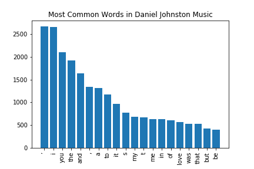

# A Linguistic Look Inside Outsider Music
## Final Report
Emma McKibbin | ECM68@pitt.edu    
May 1, 2022

#### Table of Contents:
1. Project Overview
2. What is Outsider Music?
3. Data collection
4. Data Cleaning
5. Analysis    
    - 5.1 Outsider Music vs. Pop Music    
    - 5.2 The Distribution Dilemma    
    - 5.3 Outsider Music Internal Analysis
6. The Initial Plan and the Inevitable Changes
7. Conclusion

### 1. Project Overview
This project analyzes a few very basic linguistic characteristics of the Outsider Music genre, first comparing across genres with a popular music dataset, then looking within the Outsider genre to find possible incongruities between its top artists.  Though the initial research question was intending to study more broadly the "linguistic composition" of outsider music, the final analysis was limited to token count distribution and most frequent words, both with and without stopwords.  As described in the report that follows, the final form of this project wandered a bit from the initial comparative focus and became more of an investigation into the effects of skew in data collection.  Though the analysis here may not provide conclusive answers to the original research questions, it should provide insight and inform and future endeavors on the topic of Outsider Music linguistics.

### 2. What is Outsider Music?

### 3. Data Collection

### 4. Data Cleaning

### 5. Analysis

#### 5.1 Outsider Music vs. Pop Music

#### 5.2 The Distribution Dilemma

#### 5.3 Outsider Music Internal Analysis

### 6. The Initial Plan and the Inevitable Changes

### 7. Conclusion

